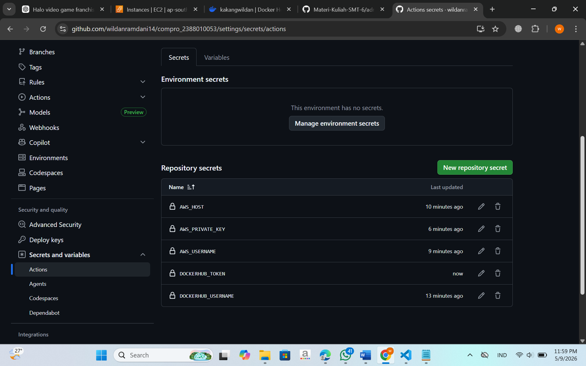
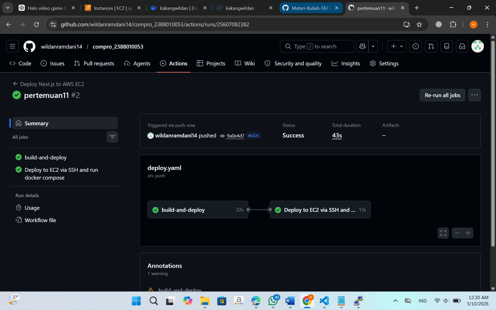
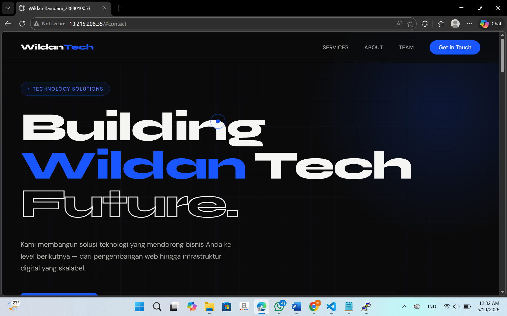

###Modernisasi CI/CD (Continuous Integration/Continuous Delivery)

##Lanjutan Praktikum Pertemuan 10

Mengisi Secrets Variable di Github Actions

1.Buka Repository di Github
Klik Settings -> Secrets and variables -> Actions
Klik New repository secret
Isi Nama = DOCKERHUB_USERNAME dan Value = username akun dockerhub
Klik New repository secret
Isi Nama = DOCKERHUB_TOKEN dan Value = token akun dockerhub
Klik New repository secret
Isi Nama = AWS_HOST dan Value = ip address EC2 instance
Klik New repository secret
Isi Nama = AWS_USERNAME dan Value = ubuntu
Klik New repository secret
Isi Nama = AWS_PRIVATE_KEY dan Value = file .pem (berisi tanda petik awal dan akhir juga)

2.Melakukan Edit File Pipeline di Github

Buka Projek compro_nim
Buat Folder Baru .github -> Buat Folder workflows -> Buat File deploy.yaml
Isi file deploy.yaml sebagai berikut : name: Deploy Next.js to AWS EC2
on:
  push:
    branches: [ main ]
jobs:
  build-and-deploy:
    runs-on: ubuntu-latest
    steps:
    - name: Checkout code
      uses: actions/checkout@v4
    - name: Login to Docker Hub
      uses: docker/login-action@v3
      with:
        username: ${{ secrets.DOCKERHUB_USERNAME }}
        password: ${{ secrets.DOCKERHUB_TOKEN }}
    - name: Build and push Docker image
      uses: docker/build-push-action@v5
      with:
        context: .
        push: true
        tags: ${{ secrets.DOCKERHUB_USERNAME }}/compro_nim:latest

  deploy:
    needs: build-and-deploy
    runs-on: ubuntu-latest
    name: Deploy to EC2 via SSH and run docker compose
    steps:
    - name: SSH and deploy
      uses: appleboy/ssh-action@v1.0.3
      with:
        host: ${{ secrets.AWS_HOST }}
        username: ${{ secrets.AWS_USERNAME }}
        key: ${{ secrets.AWS_PRIVATE_KEY }}
        port: 22
        script: |
          docker rm -f compro_nim || true
          docker pull ${{ secrets.DOCKERHUB_USERNAME }}/compro_nim:latest
          docker run -d --name compro_nim -p 80:80 ${{ secrets.DOCKERHUB_USERNAME }}/compro_nim:latest

3.Sebelum melakukan commit dan Synch pada File

Pastikan sudah disable apache2 -> sudo systemctl disable apache2
Pastikan sudah stop apache2 -> sudo systemctl stop apache2
Pastikan user ubuntu sudah ditambahkan ke docker -> sudo usermod -aG docker ubuntu
Baru lakukan Commit dan Push ke Github

4.Update tag Title -> Nama - NIM
