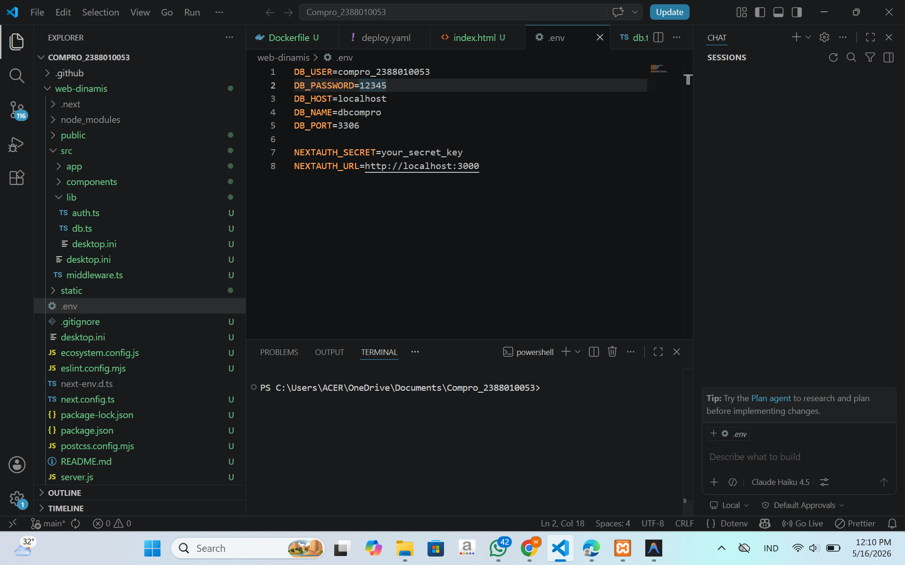
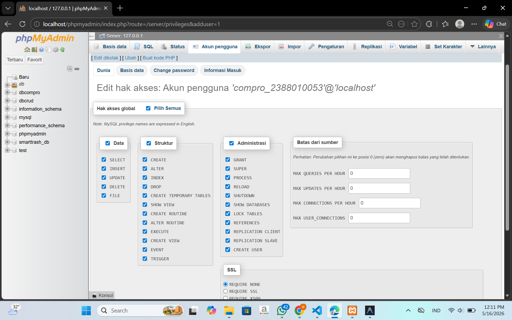
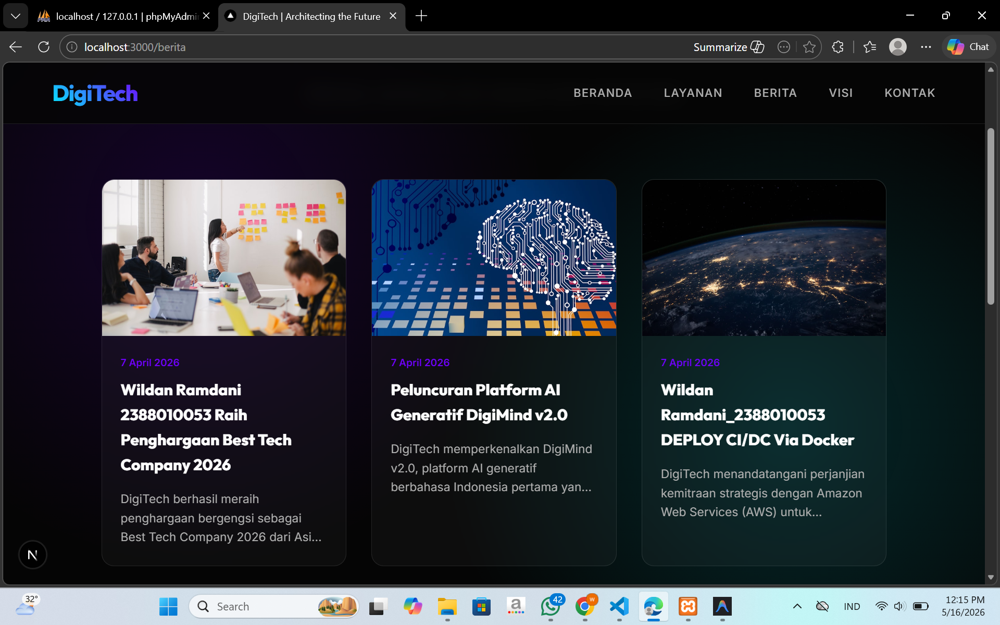

# deploy multi apps CI/CD docker

1.start instance di AWS EC2 

2.patching OS > sudo apt update && sudo apt upgrade

3.hapus layanan nginx dan unintstall > sudo systemctl stop nginx && systemctl disable nginx sudo apt remove nginx nginx-common nginx-core
sudo apt remove apache2 

4.hapus layanan maria db dan uninstall > sudo systemctl stop mariadb && systemctl disable mariadb sudo apt remove mariadb-server mariadb-client mariadb-common
sudo apt auto-remove mariadb-server

5.testing next.js + db menggunakan user bukan root pada local environment 
  -copy project digitech pada pertemuan6 kecuali folder .next, node_modules ,sql ke dalam folder web-dinamis
  

  -create user baru bukan root di DBMS (laragon,Xampp,etc)
  

  -sesuaikan isi file .env
  -open terminal > cd web-dinamis
  -npm i
  -npm run dev
  -edit berita ke 3 menjadi nama sama nim
  