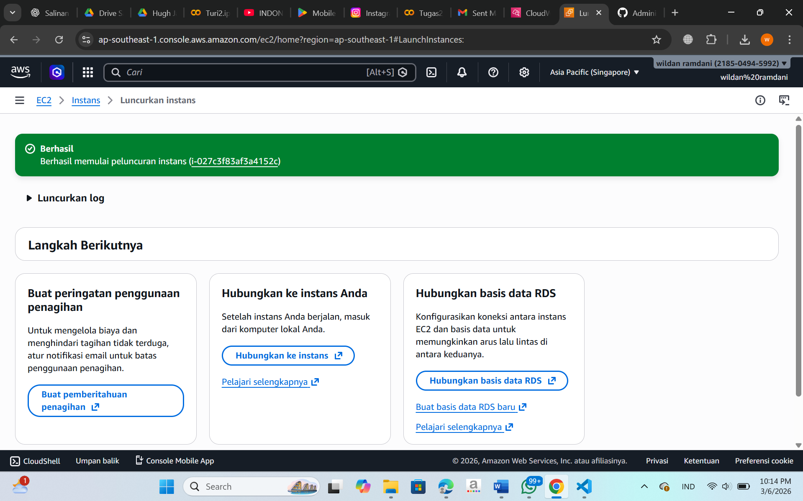
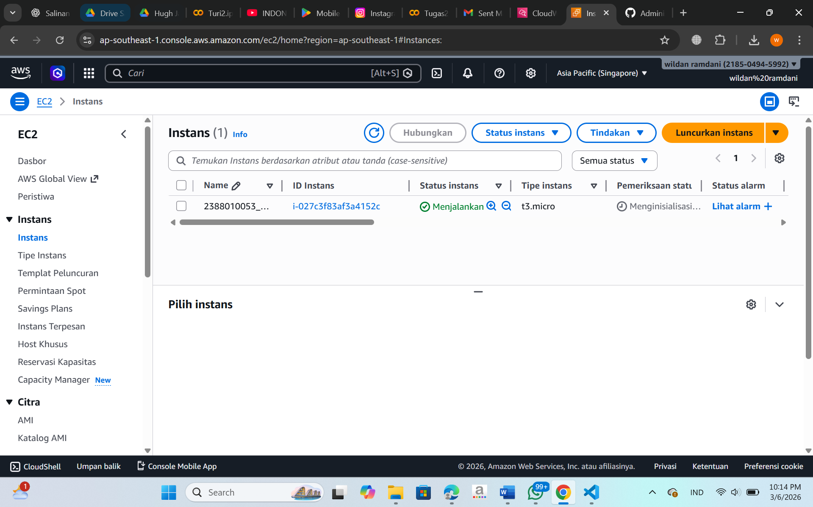

### Membuat instance di AWS EC2 dan AMI (Amazon Machine Image)

Search EC2
Instans
kembali lagi region ke region yang terdekat (jakarta/singapore)
Launch Instans
isi nama instans (NIM_Server6b)
OS Ubuntu
type instans(t3.micro)
Membuat Key pair > Create New Key > isi nama > file. pem

Pengaturan Jaringan (Allow semua 3 box)

Izinkan lalu lintas SSH dari
Izinkan lalu lintas HTTPS dari internet
Izinkan lalu lintas HTTP dari internet
configure Storage
1x30 gb
Luncurkan Instans
berhasil 

