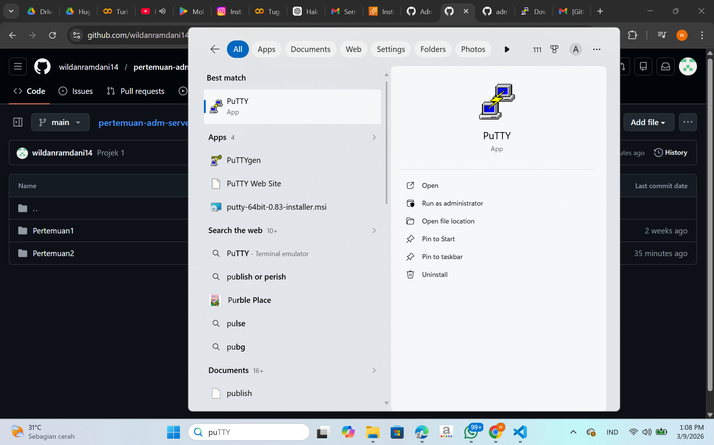
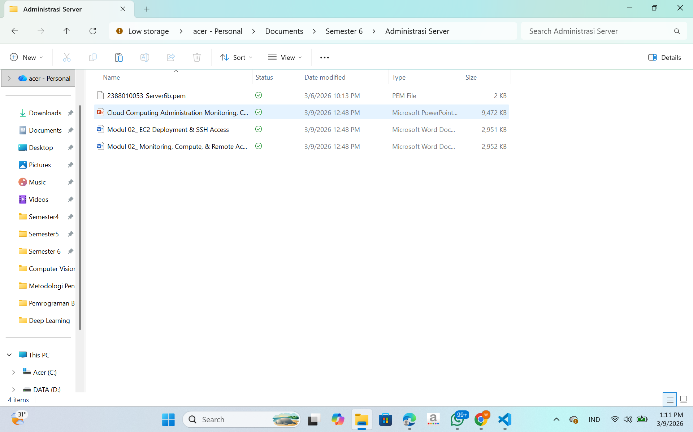
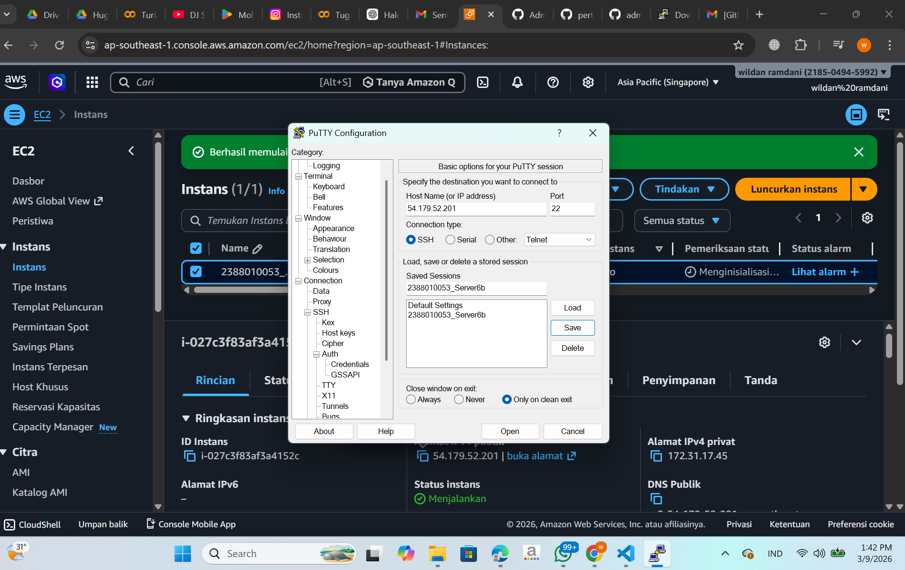
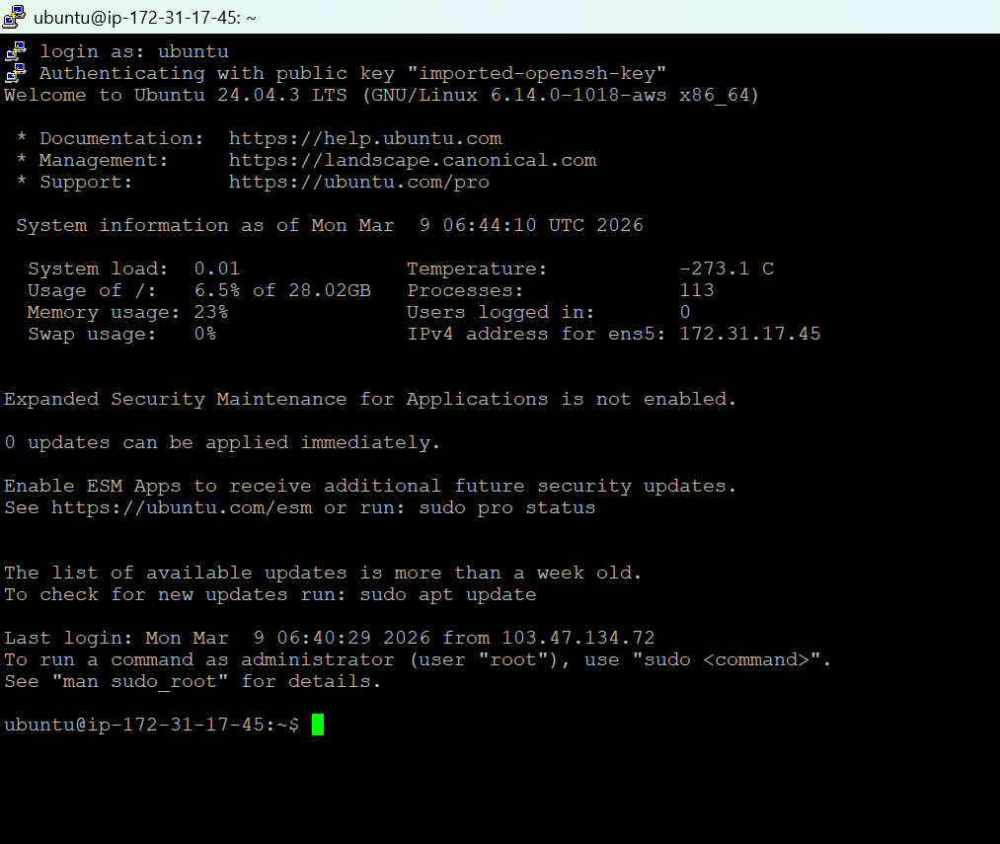
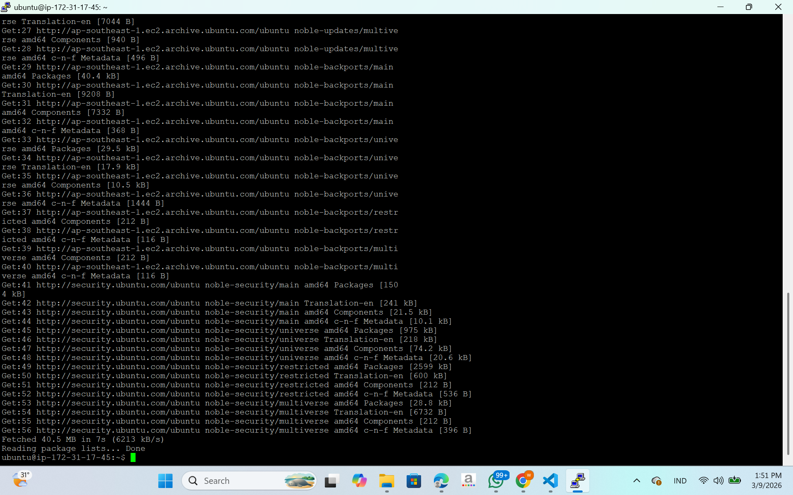
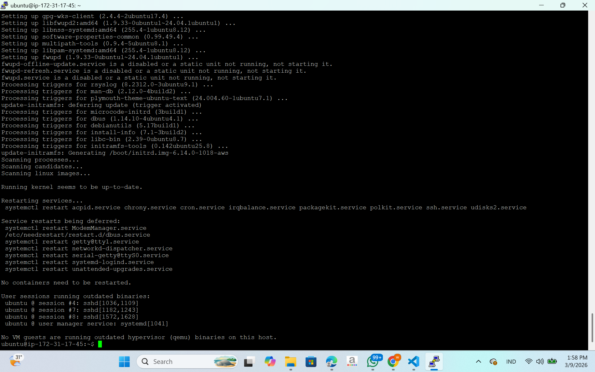
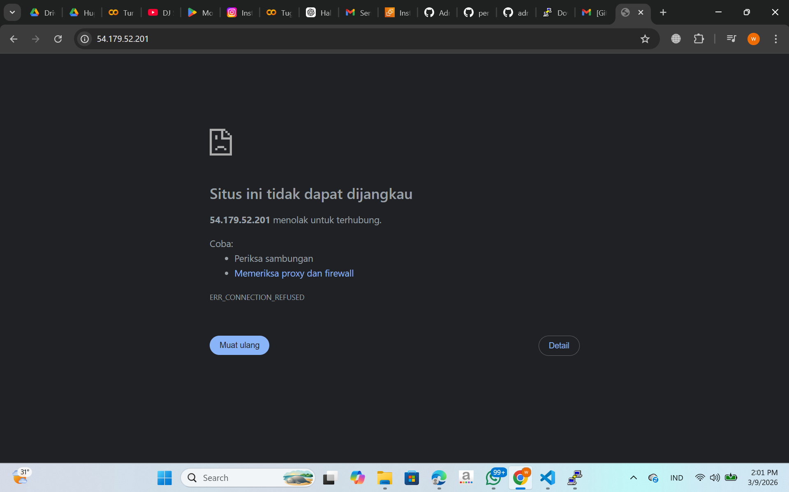
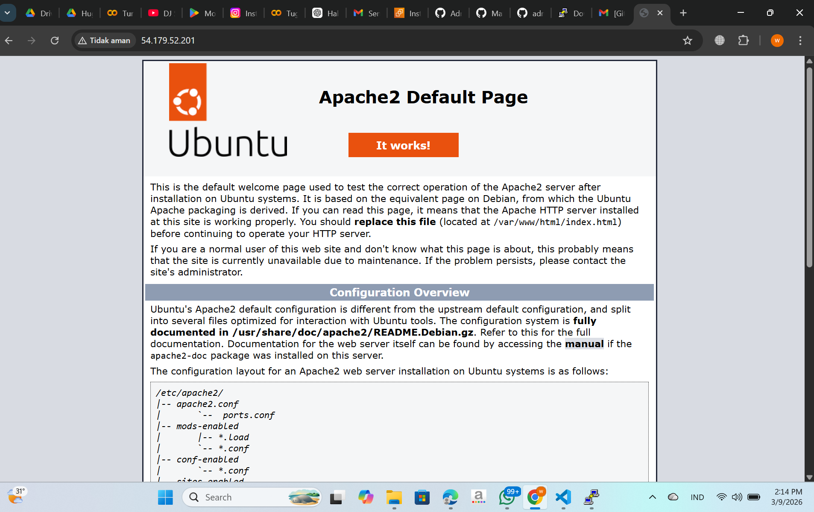
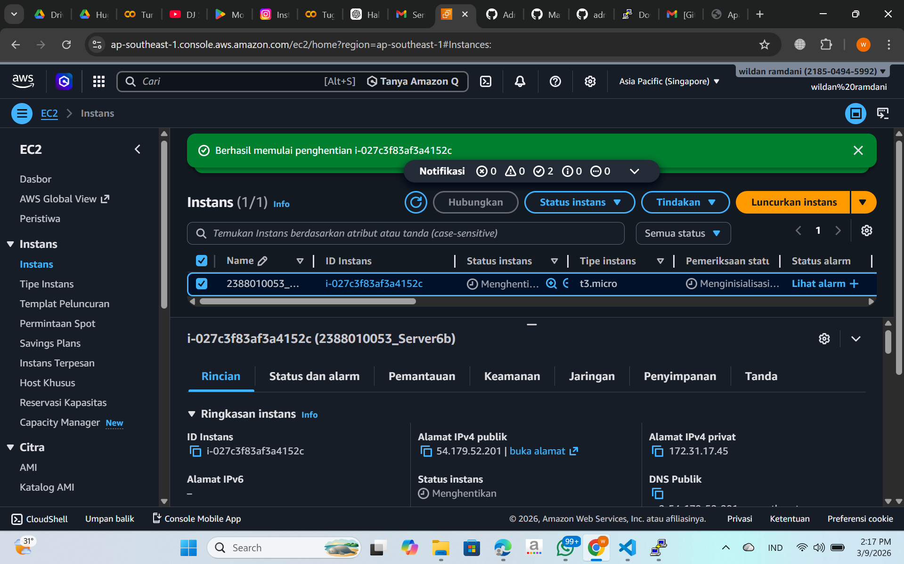

### Remote Instance With SSH putty

1.pastikan sudah install putty

2.Konversi File Publice Key dari .pem menjadi .ppk di putty
buka puttyGen
load file .pem
save as .ppk

3.set up putty untuk remote SSH

buka apps putty
isi IP public sesuai instance
isi port untuk SSH sesuai Security group di instance
isi nama session agar saat connect lagi tinggal load saja
load file .ppk
kembali ke session sesuai

 tanda berhasil
 

4.sudo apt-get update

 sudo apt-get upgrade

5.Pembuktian Remote SSH secara visual
copy public IP Address instance paste ke browser

Install Web Server seperti Apache/Nginx
sudo apt install apache2
Reload Browser

6.Matikan Instance agar tidak kena tagihan

