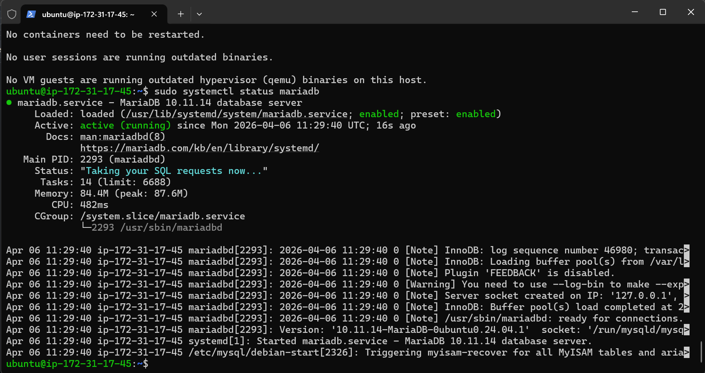
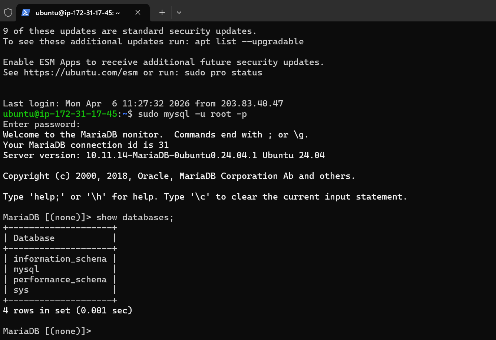
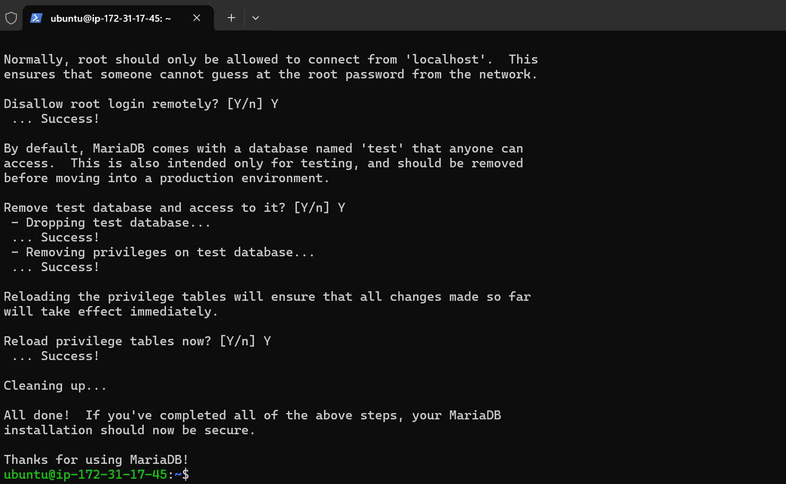
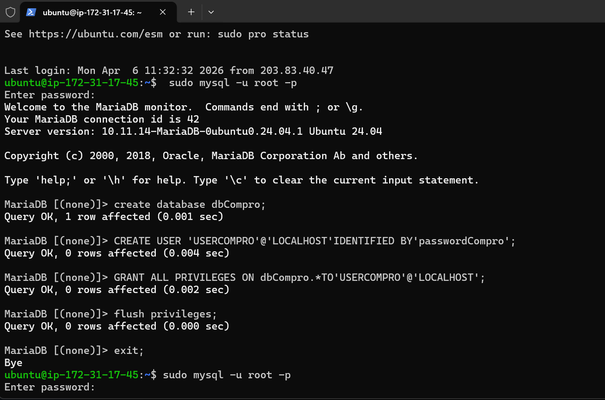
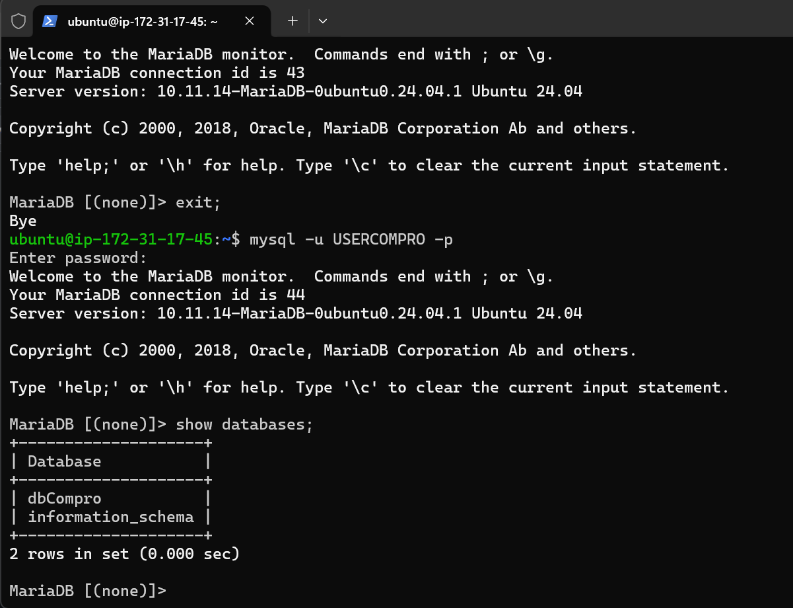

### Membuat Database MySQL di AWS EC2

1.Aktifkan Instance / VM di EC2

2.Remote SSH via Terminal

Masuk ke folder peyimpanan private key AWS
Masukan command (ssh -i namafile.pem ubuntu@[IP_ADDRESS])
Tekan Enter

3.Lakukan Patching OS

sudo apt-get update && sudo apt-get upgrade

4.kita akan install MariaDb

sudo apt-get install mariadb-server
sudo systemctl status mariadb
coba apakah default setting yang berlaku (sudo mysql -u root -p)
cek apakah masih ada database dummy (show databases;)

5.kita lakukan hardening security

masukan command (sudo mysql_secure_installation)
masukan password kuat untuk user root
Remove anonymous users? [Y/n] Y
Disallow root login remotely? [Y/n] Y
Remove test database and access to it? [Y/n] Y
Reload privilege tables now? [Y/n] Y 

6.membuat database dan user

membuat database untuk web company profile(create database dbCompro;)
membuat user untuk web company profile (CREATE USER 'USERCOMPRO'@'LOCALHOST' IDENTIFIED BY 'passwordCompro';)
memberikan hak akses untuk web company profil (GRANT ALL PRIVILEGES ON dbCompro.* TO 'USERCOMPRO'@'LOCALHOST';)
flush privileges (flush privileges;)
keluar dari MySQL (exit;)

7.login sebagai user baru

Masukan Commad (mysql -u userCompro -p;)
masukan password
cek apakah database dbCompro sudah ada (show databases;)

