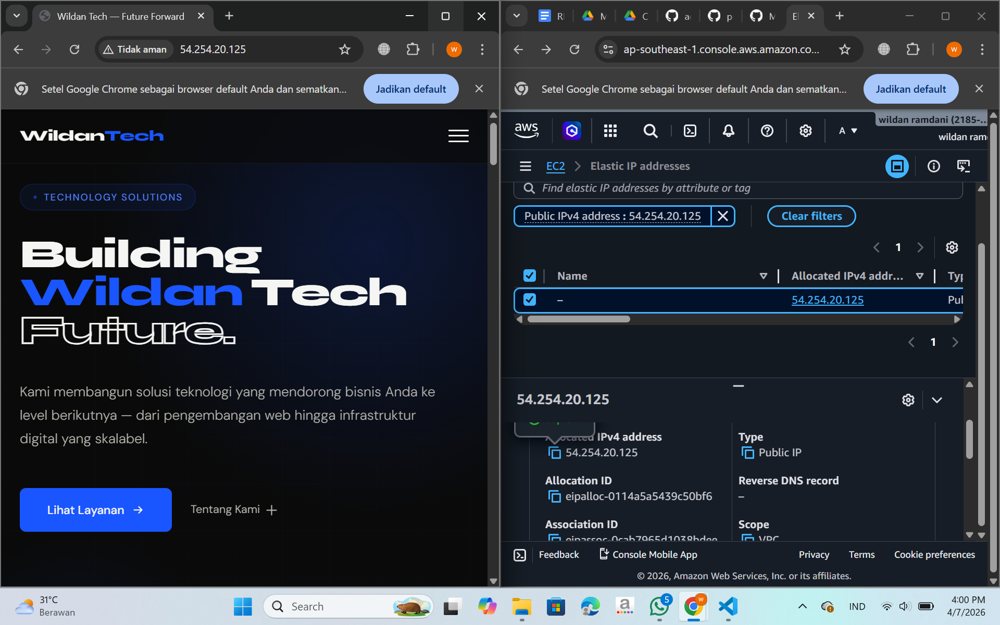

# Membuat Elastic IP di AWS

1.Jalankan Instance EC2 yang sudah dicreate sebelumnya

2.ke Menu Network and Security pilih menu Elastics IP
Klik Menu Allocate Elastic Ip Address
Pilih Amazon's pool of IPv4 addresses
Network Border Group (South East Asia)
Isi Tags (Key=server-6B value=Praktikum Elastic IP)
Klik Allocate

3.Associate kan Elastic IP segera mungkin (>1 jam akan kena cost)
Centang mana EIP yang dipilih
pilih Actions -> Associate Elastic IP
Resource type pilih instance
Pilih Instance (NIM-SERVER6B)
klik Associate

