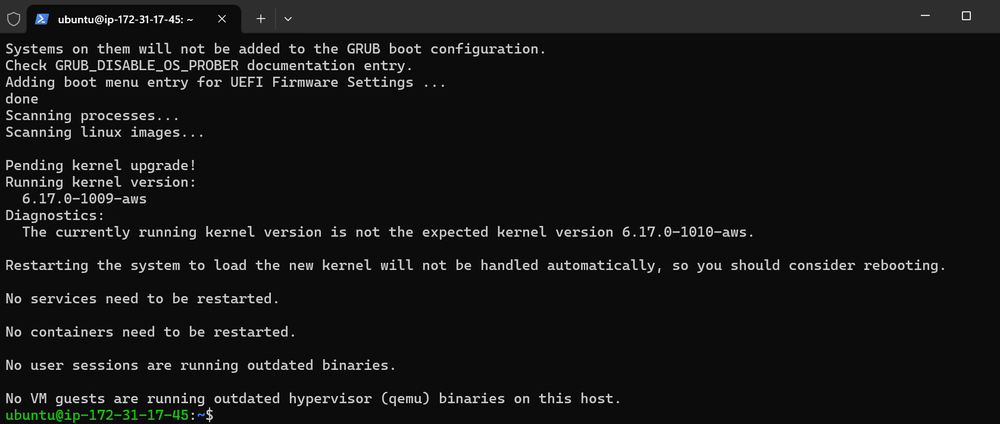
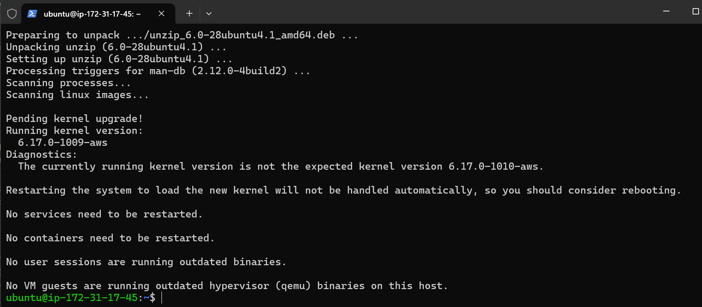
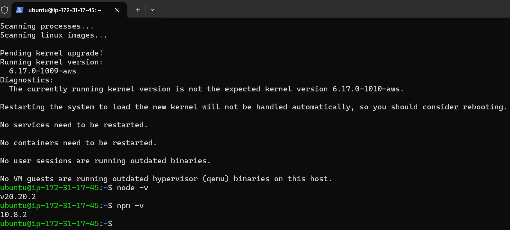
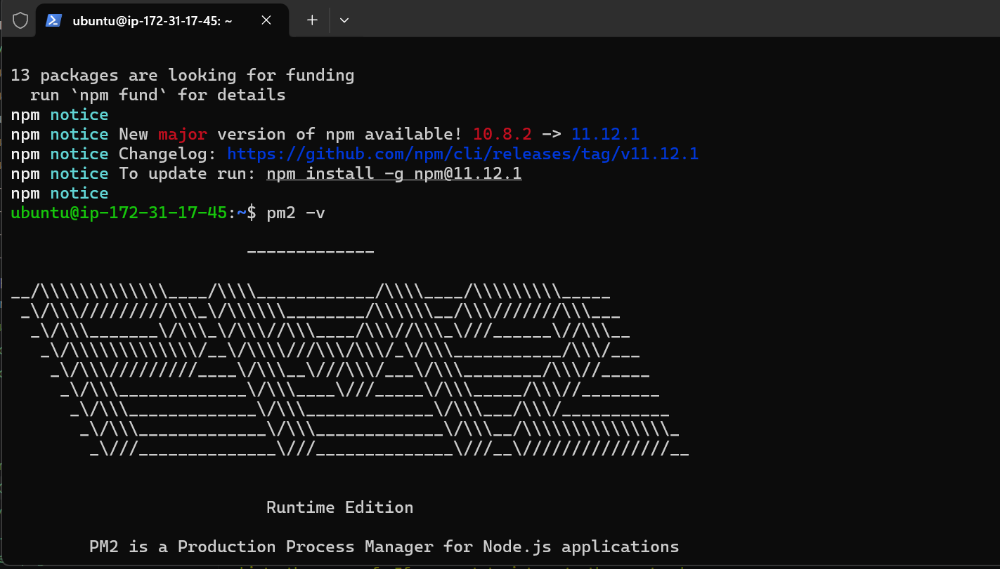
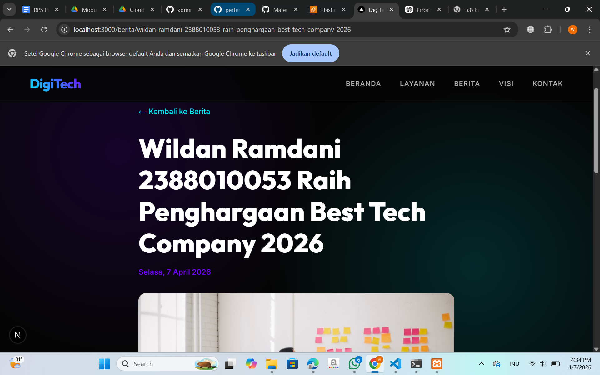

# Panduan Deployment DigiTech ke AWS EC2
> **Mata Kuliah:** Cloud Computing  
> **Stack:** Next.js (Standalone) + MariaDB + Apache2 Reverse Proxy  
> **Akses:** Menggunakan IP Publik EC2 (tanpa domain)

---

## Prasyarat

| Kebutuhan | Spesifikasi |
|---|---|
| EC2 Instance | Ubuntu 22.04 LTS / 24.04 LTS |
| Instance Type | Minimal `t2.micro` (Free Tier) |
| Security Group | Buka port **22** (SSH), **80** (HTTP), **3000** (opsional debug) |
| Storage | Minimal 8 GB |

### Cek IP Publik EC2 Anda
Setelah instance berjalan, catat **Public IPv4 Address** dari halaman EC2 Console.  
Contoh: `13.215.xxx.xxx`

---

## Langkah 1 — Masuk ke Server via SSH

```bash
ssh -i "nama-key.pem" ubuntu@<IP-PUBLIK-EC2>
```

---

## Langkah 2 — Update Sistem & Install Dependensi

```bash
sudo apt update && sudo apt upgrade -y
sudo apt install -y curl git unzip apache2
```


---

## Langkah 3 — Install Node.js v20

```bash
curl -fsSL https://deb.nodesource.com/setup_20.x | sudo -E bash -
sudo apt install -y nodejs
node -v   # pastikan v20.x
npm -v

```

---

## Langkah 4 — Install PM2 (Process Manager)

```bash
sudo npm install -g pm2
pm2 -v

```

---

## Langkah 5 — Install & Konfigurasi MariaDB

### a) Install MariaDB
```bash
sudo apt install -y mariadb-server
sudo systemctl start mariadb
sudo systemctl enable mariadb
```

### b) Amankan instalasi MariaDB
```bash
sudo mysql_secure_installation
```
Ikuti prompts:
- **Enter current password for root:** (kosongkan, tekan Enter)
- **Switch to unix_socket authentication?** → `n`
- **Change the root password?** → `Y` → masukkan password root yang aman
- **Remove anonymous users?** → `Y`
- **Disallow root login remotely?** → `Y`
- **Remove test database?** → `Y`
- **Reload privilege tables?** → `Y`

### c) Buat database dan user untuk aplikasi
```bash
sudo mysql -u root -p
```

Jalankan SQL berikut di dalam prompt MariaDB:
```sql
CREATE DATABASE dbcompro CHARACTER SET utf8mb4 COLLATE utf8mb4_unicode_ci;
CREATE USER 'digitech_user'@'localhost' IDENTIFIED BY 'password_db_anda';
GRANT ALL PRIVILEGES ON dbcompro.* TO 'digitech_user'@'localhost';
FLUSH PRIVILEGES;
EXIT;
```
> ⚠️ Ganti `password_db_anda` dengan password yang kuat.

---

## Langkah 6 — Clone & Setup Aplikasi

```bash
sudo mkdir -p /var/www/digitech
sudo chown -R $USER:$USER /var/www/digitech
cd /var/www/digitech
git clone <URL-REPO-ANDA> .
cd digitech-nextjs
```

### Buat file `.env`
```bash
cp .env.example .env
nano .env
```

Isi file `.env` dengan konfigurasi berikut:
```env
DB_HOST=localhost
DB_USER=digitech_user
DB_PASSWORD=password_db_anda
DB_NAME=dbcompro
DB_PORT=3306

NEXTAUTH_SECRET=ganti-dengan-string-acak-panjang-minimal-32-karakter
NEXTAUTH_URL=http://<IP-PUBLIK-EC2>
```

> Contoh `NEXTAUTH_URL=http://13.215.xxx.xxx`

---

## Langkah 7 — Import Skema Database

```bash
mysql -u digitech_user -p dbcompro < sql/schema.sql
```
Masukkan `password_db_anda` saat diminta.

Verifikasi data berhasil masuk:
```bash
mysql -u digitech_user -p dbcompro -e "SHOW TABLES; SELECT username FROM users;"
```

---

## Langkah 8 — Build Aplikasi Next.js

```bash
npm install
npm run build
```

Script `postbuild` akan otomatis menyalin aset statis ke folder standalone.

> Proses build membutuhkan waktu 2–5 menit, bersabar ya 😄

---

## Langkah 9 — Konfigurasi File PM2

Edit file `ecosystem.config.js` yang sudah ada:
```bash
nano ecosystem.config.js
```

Pastikan isinya seperti berikut:
```javascript
module.exports = {
  apps: [
    {
      name: "digitech",
      script: ".next/standalone/server.js",
      cwd: "/var/www/digitech/digitech-nextjs",
      env: {
        NODE_ENV: "production",
        PORT: 3000,
        HOSTNAME: "0.0.0.0",
      },
    },
  ],
};
```

---

## Langkah 10 — Jalankan Aplikasi dengan PM2

```bash
pm2 start ecosystem.config.js
pm2 save
pm2 startup
```

Salin dan jalankan perintah yang muncul dari `pm2 startup` (biasanya diawali `sudo env PATH=...`).

Cek status:
```bash
pm2 status
pm2 logs digitech
```

---

## Langkah 11 — Setup Apache2 sebagai Reverse Proxy

### a) Aktifkan modul yang diperlukan
```bash
sudo a2enmod proxy proxy_http headers
sudo systemctl restart apache2
```

### b) Buat Virtual Host baru
```bash
sudo nano /etc/apache2/sites-available/digitech.conf
```

Isi dengan konfigurasi berikut (**tanpa domain, pakai IP**):
```apache
<VirtualHost *:80>
    # Tidak menggunakan ServerName karena akses pakai IP langsung

    ProxyPreserveHost On
    ProxyPass / http://localhost:3000/
    ProxyPassReverse / http://localhost:3000/

    RequestHeader set X-Forwarded-Proto "http"
    RequestHeader set X-Forwarded-Port "80"

    ErrorLog ${APACHE_LOG_DIR}/digitech_error.log
    CustomLog ${APACHE_LOG_DIR}/digitech_access.log combined
</VirtualHost>
```

### c) Aktifkan site dan restart Apache
```bash
sudo a2ensite digitech.conf
sudo a2dissite 000-default.conf   # nonaktifkan default site
sudo apache2ctl configtest        # pastikan tidak ada error (Syntax OK)
sudo systemctl restart apache2
```

---

## Langkah 12 — Verifikasi Deployment

Buka browser dan akses:
```
http://<IP-PUBLIK-EC2>
```

Coba halaman lainnya:
- `http://<IP-PUBLIK-EC2>/admin` → Dashboard admin
- `http://<IP-PUBLIK-EC2>/berita` → Halaman berita
- `http://<IP-PUBLIK-EC2>/api/berita` → API JSON

Login admin:
- **Username:** `admin`  
- **Password:** `admin123`

---

## Perintah Berguna (Maintenance)

```bash
# Lihat status aplikasi
pm2 status

# Lihat log real-time
pm2 logs digitech --lines 100

# Restart aplikasi setelah update
pm2 restart digitech

# Rebuild setelah perubahan kode
cd /var/www/digitech/digitech-nextjs
git pull
npm install
npm run build
pm2 restart digitech

# Cek log Apache
sudo tail -f /var/log/apache2/digitech_error.log
sudo tail -f /var/log/apache2/digitech_access.log

# Cek status MariaDB
sudo systemctl status mariadb
```

---

## Troubleshooting

| Masalah | Solusi |
|---|---|
| Halaman tidak bisa diakses | Cek Security Group EC2 — pastikan port 80 terbuka untuk `0.0.0.0/0` |
| CSS/JS tidak muncul | Jalankan `npm run build` ulang, pastikan `postbuild` berjalan |
| Error database | Cek `.env` sudah benar dan MariaDB berjalan (`sudo systemctl status mariadb`) |
| NextAuth error `NO_SECRET` | Pastikan `NEXTAUTH_SECRET` di `.env` sudah diisi |
| Login gagal | Verifikasi data user dengan `SELECT * FROM users;` di MariaDB |
| PM2 tidak jalan otomatis | Jalankan ulang `pm2 startup` dan salin perintah yang muncul |

---

> **Catatan untuk Pengumpulan Tugas:**  
> Screenshot bukti deployment minimal meliputi: (1) halaman utama via IP, (2) halaman `/admin` setelah login, dan (3) output `pm2 status` di terminal EC2.
