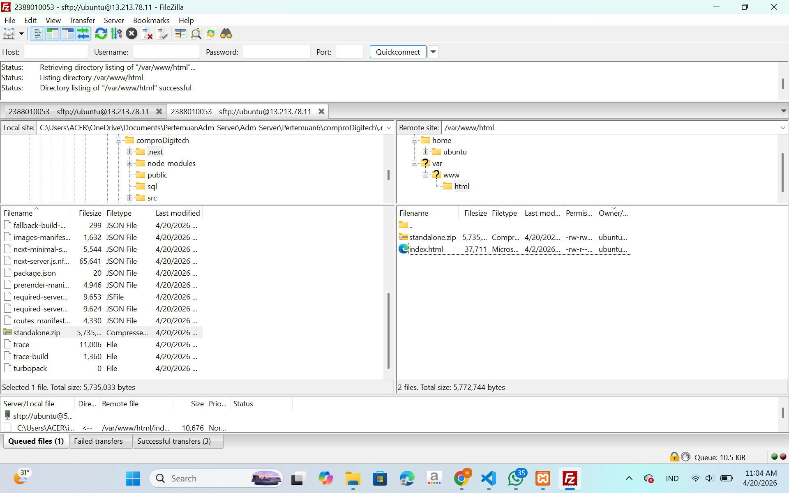
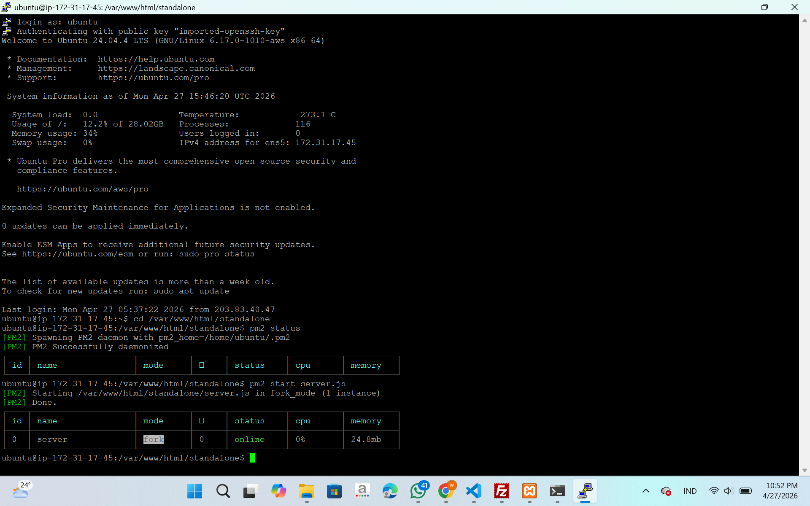
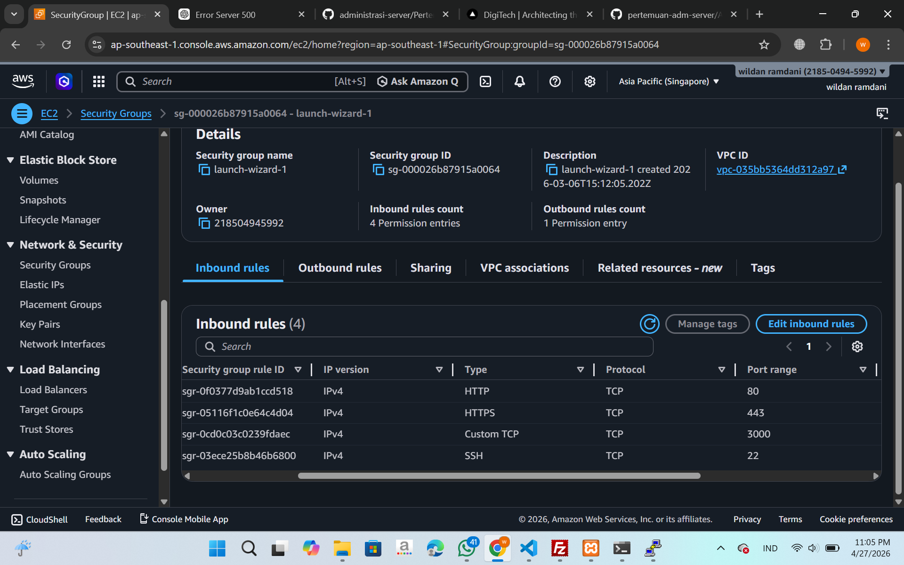
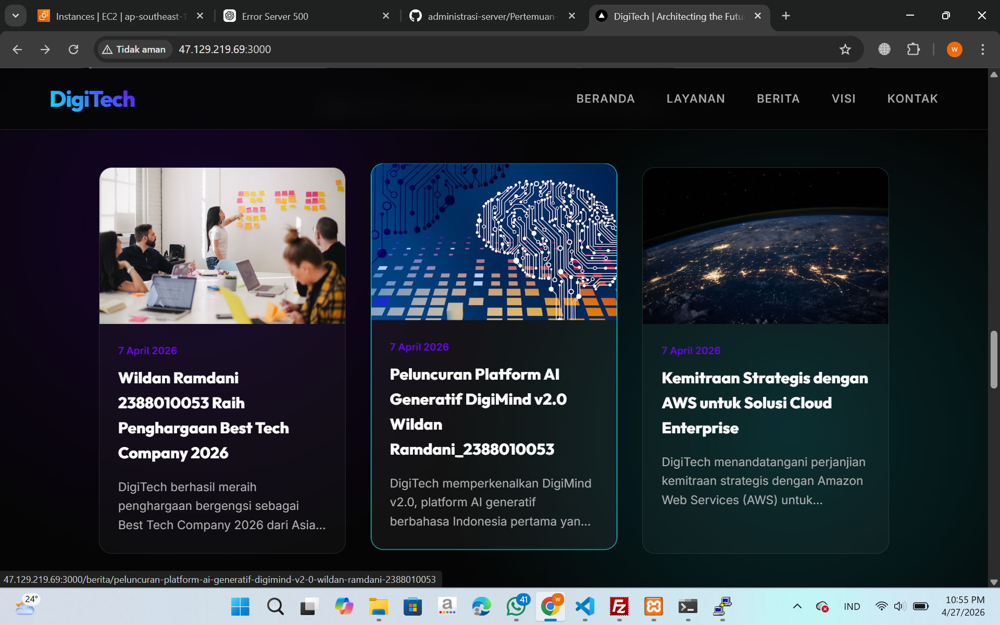

# melakukan uploding web apps dynamic ke EC2 AWS

1.pastikan web apps dynamic sudah berjalan tanpa error di local host
2.jika sudah tanpa error kita akan membuat folder build
  -npm run build (ketika sudah final)
  -pastikan menghasilkan folder .next/standalone di dalam tersedia folder public di dalam folder   
  .next ada ada folder static 

3.proses upload file folder standalone
  -lakukan proses archive pada folder  .next/standalone dan folder public .zip
  -running instance > connect open SSH > connect filezilla
  -upload file hasil archive ke EC2 AWS Mmenggunakan filezilla
  
  -ekstrak file hasil asrchive di EC2 AWS
    1.install tools unzip di EC2 AWS 
     -sudo apt install unzip -y
    2.extrak file hasil
     -unzip nama_file.zip

4.export dbCompro dari localhost import ke ec2 AWS

login ke SQL ec2 sudo mysql -u USERCOMPRO -p
use dbCompro;
copy paste query SQL dari export dbCompro di Localhost
cek setiap tabel aoakah sudah terisi
select * from berita;
select * from users;

5.sesuaikan isi dile .env di ec2 aws

DB_HOST=localhost
DB_USER=USERCOMPRO
DB_PASSWORD=PASSWORD
DB_NAME=dbCompro
ctrl s

6.di terminal ssh cd ke folder standalone run apps -pm2 start server.js -pm2 save -pm2 startup;

7.Buka port 3000 di security group ec2 aws

edit security group
add rule
save

cek perubahan
