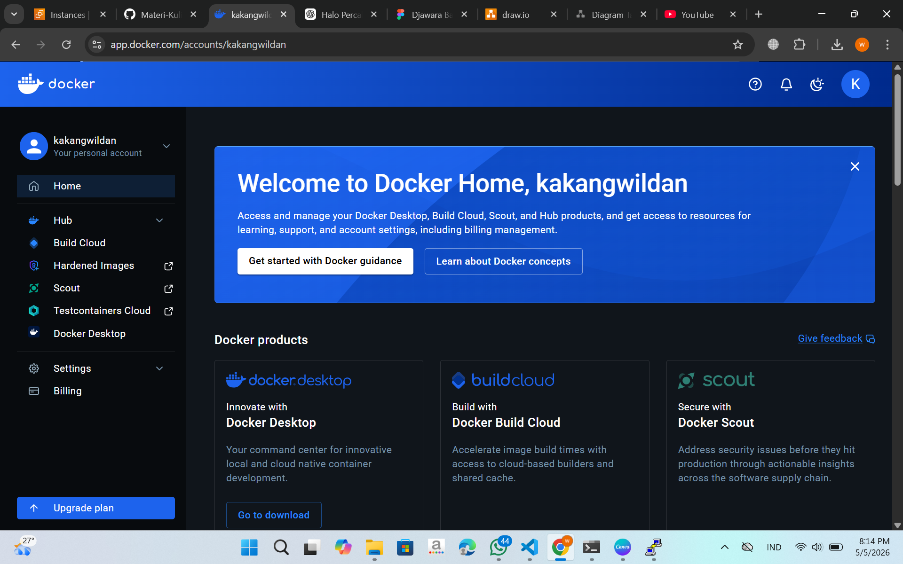
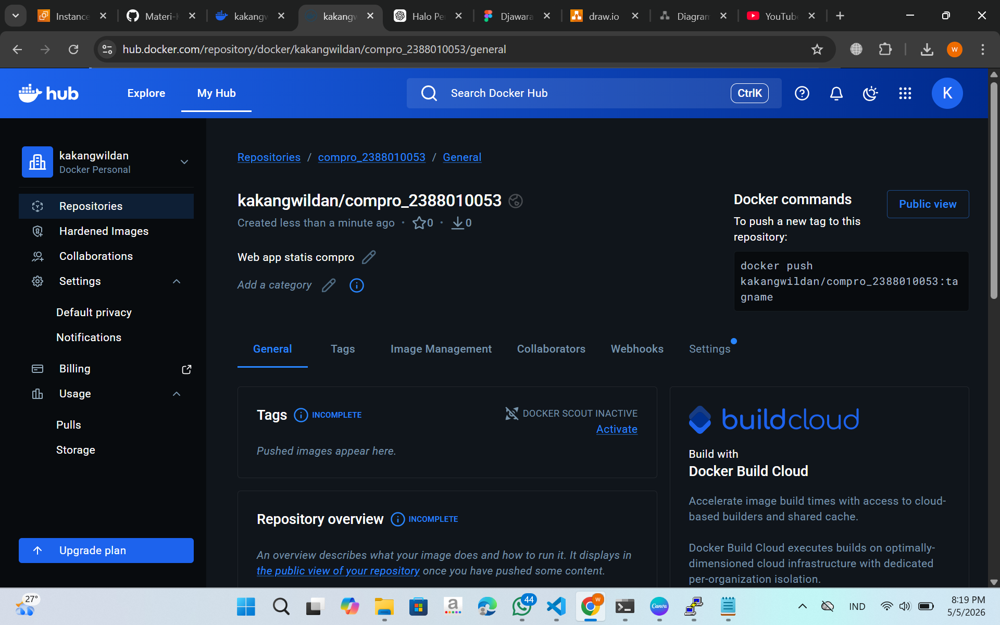
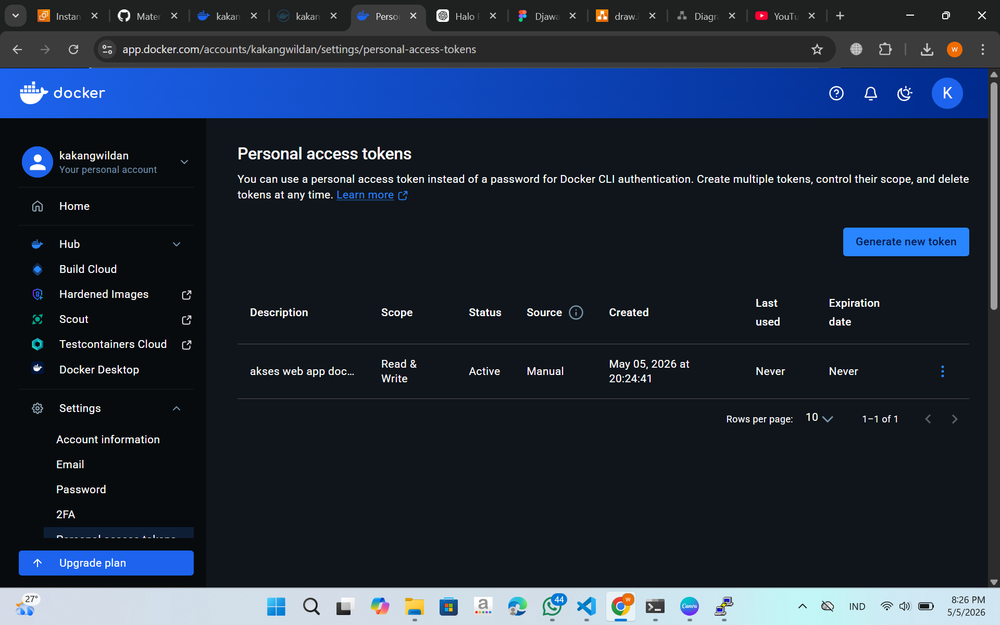
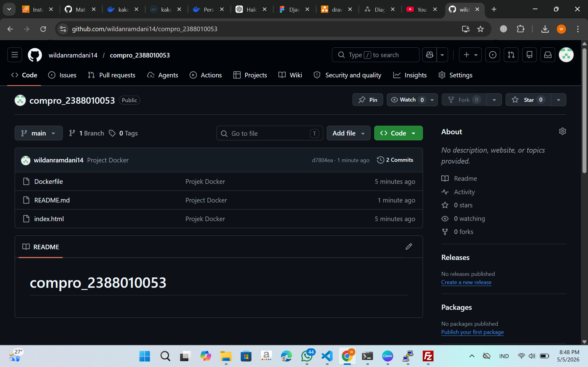

1.install docker :
https://docs.docker.com/engine/install/ubuntu/

Uninstall old version Docker sudo apt remove $(dpkg --get-selections docker.io docker-compose docker-compose-v2 docker-doc podman-docker containerd runc | cut -f1)
Intall Docker A. sudo apt-get update && sudo apt-get upgrade B. add Cert Repository for Docker sudo apt install ca-certificates curl sudo install -m 0755 -d /etc/apt/keyrings sudo curl -fsSL https://download.docker.com/linux/ubuntu/gpg -o /etc/apt/keyrings/docker.asc sudo chmod a+r /etc/apt/keyrings/docker.asc C. Add Docker Repository to APT sudo tee /etc/apt/sources.list.d/docker.sources <<EOF Types: deb URIs: https://download.docker.com/linux/ubuntu Suites: 
Unable to render expression.
$(. /etc/os-release &amp;&amp; echo "${UBUNTU_CODENAME:-$VERSION_CODENAME}") Components: stable Architectures: $(dpkg --print-architecture) Signed-By: /etc/apt/keyrings/docker.asc EOF D. Update OS -> sudo apt-get update E. Install Docker Engine -> sudo apt install docker-ce docker-ce-cli containerd.io docker-buildx-plugin docker-compose-plugin F. cek installation -> sudo systemctl status docker 

2.Registrasi Docker Hub

URL Docker hub -> https://hub.docker.com/signup
Continue with Github
Login

3.Create Repository for Docker

Klik Menu->Hub->Repositories
Klik Button New Repository
Isi Nama Repository = compro_nim dan Deskripsi = Web app statis compro
Visibility = Public
Klik Create

Create token access

4.Klik Profile->Settings->personal access tokens
Klik Generate New Token
isi Deskripsi
expire date = none
access permission = read/write
Klik Generate

5.Create Projek di Local

Buat Folder compro_nim
Masukan file Index.html compro
Buat file Dockerfile dengan isi sebagai berikut FROM nginx:alpine COPY index.html /usr/share/nginx/html EXPOSE 80

6.Push Projek Ke Github

Buat Repositori di Github
Push Projek ke Github
git init
git add .
git commit -m "Projek Docker"
git branch -M main
git remote add origin https://github.com/wildanramdani14/compro_2388010053
git push -u origin main
