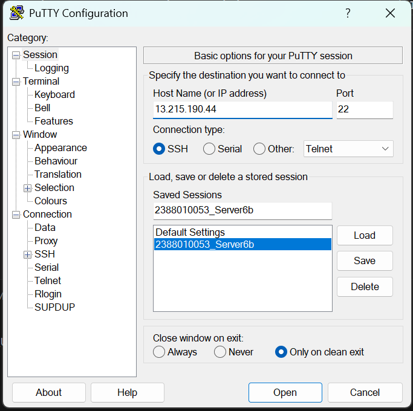
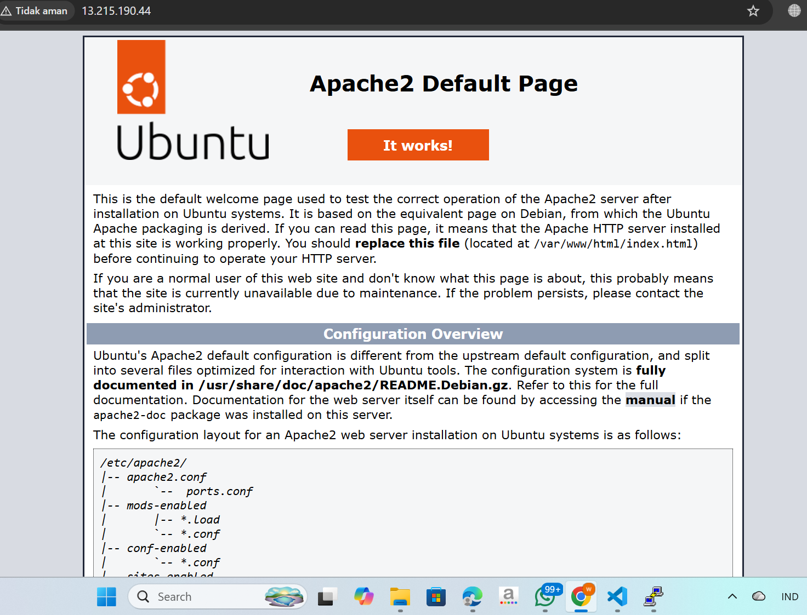
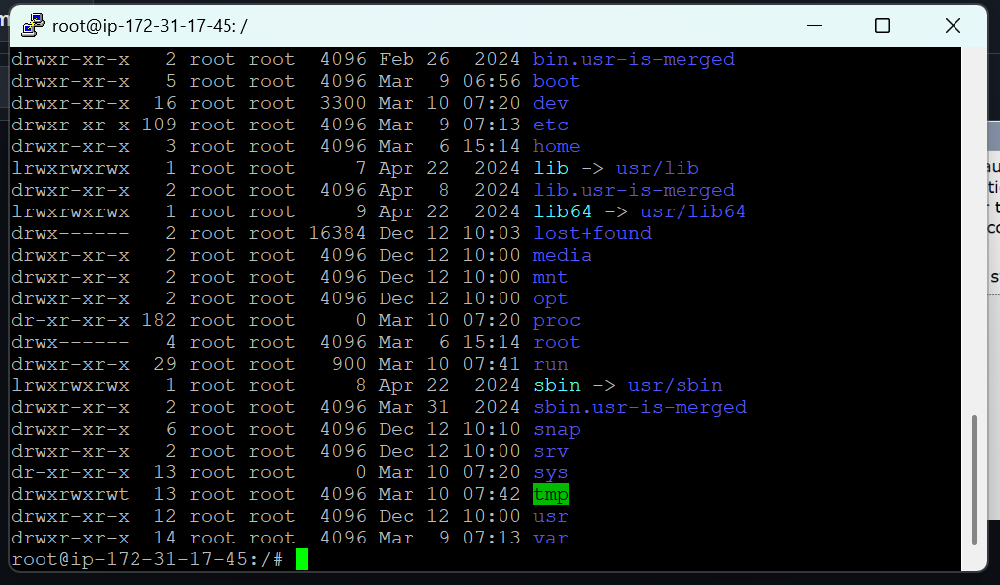
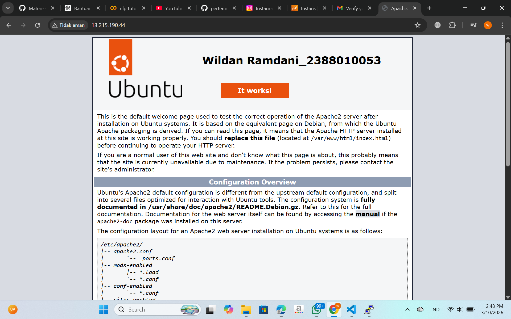

### Implementasi beberapa comand line Interface Linux Ubuntu

Start Instance
Buka Putty
Kemudian Load save session yg disimpan pada pertemuan 2 (NIM_server)

Update Bagian ipaddress v4
sudo apt-get update (untuk Paching OS Linux server)
Cek Web server kita (systemctl status apache2)
sudo systemctl stop apache2 (untuk berhentikan Web Server)
sudo systemctl start apache2 (untuk start ulang Web Server)

masukan command (ls -la) untuk melihat directory tempat cursor aktif
masukan sudo su (untuk masuk ke home)
masukan cd .. untuk ke Root Folder ls -la

masuk ke folder Var (cd var/www/html)
nano index.html untuk custom Nama dan NIM
